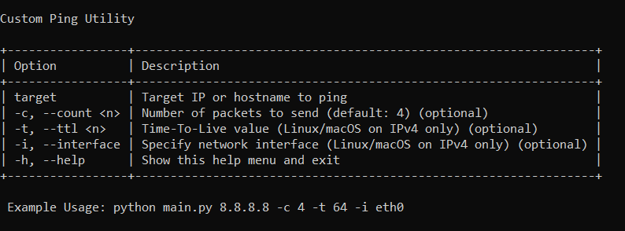
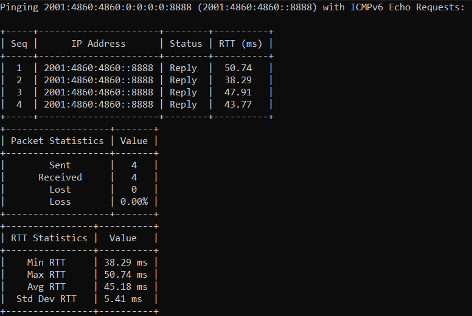

# Custom Ping Utility

This is a Python-based command-line tool designed to send ICMP Echo Requests (ping) to a target.This custom-built ping utility supports **ICMPv4 & ICMPv6** with features like **real-time tabular output**, **network interface selection**, and **detailed statistics**.This utility is particularly useful for network troubleshooting, latency analysis, and learning how ICMP packets work at a lower level using raw sockets. 

## Features 🚀
✅ Supports both **IPv4 & IPv6**  
✅ Displays **real-time results** in a **tabular format**  
✅ Works with **custom packet counts, TTL, and network interfaces**  
✅ Provides **detailed statistics** including packet loss, average RTT and standard deviation of RTT  
✅ **Admin/root detection** for privileged operations  
✅ Supported on **Linux, Mac OS and Windows**

## Output Showcase

### Help window ❤️



### Ping Output ✨



## 🛠️ Installation & Setup

### **1️⃣ Install Dependencies**
Ensure you have **Python 3.6+** installed. You can check with:
```sh
python3 --version
```
Install prettytable module with the following command
```sh
pip install prettytable
```
### **2️⃣ Clone or Download the Repository**
Either download the repository from the below link or clone as mentioned
```sh
git clone https://github.com/akh7177/networkincode-classroom-custom-ping-utility-new-custom_ping_utility.git
cd networkincode-classroom-custom-ping-utility-new-custom_ping_utility/src
```

### 3️⃣ Run the script
**Note: This script required admin/root access as it involves the use of raw scokets.** 

- If in Linux/Mac OS run:
```sh
sudo python3 main.py <target_ip/hostname>
```
- If in windows, open commmand prompt or powershell with administrator previlages and run:
```sh
python3 main.py <target_ip>
```
For more information regarding the script usage, refer the below section.

## 🎯 Script Usage
### Show Help
```sh
sudo python3 main.py -h
```
###  Basic Ping (Default: 4 Packets)
```sh
sudo python3 main.py <target_ip/hostname>

#Example usages
sudo python3 main.py google.com
sudo python3 main.py 8.8.8.8
sudo python3 main.py 2001:4860:4860::8888
```
### Specify the count of packets to send 
```sh
sudo python3 main.py <target_ip/hostname> -c <number_of_packets_to_send>

#Example usage
sudo python3 main.py 8.8.8.8 -c 7
```
### Specify Time-To-Live (TTL) (Linux/macOS Only)
```sh
sudo python3 main.py 8.8.8.8 -t <time_to_live_in_ms>

#Example usage
sudo python3 main.py 8.8.8.8 -t 64
```
### Select a Network Interface (Linux/macOS Only)
```sh
sudo python3 main.py <ip_address/hostname> -i <chosen_network_interface>

#Example usage
sudo python3 main.py 8.8.8.8 -i eth0
```
## 🧪 Running Tests
Automated tests can be runusing the provided test.sh script in the scripts directory.
```sh
chmod +x test.sh
sudo ./test.sh
```
Tests include:  
✅ Dependecies check  
✅ Help screen output check  
✅ IPv4 ping checks with various flags  
✅ IPv6 ping checks  
✅ Invalid host handling  


